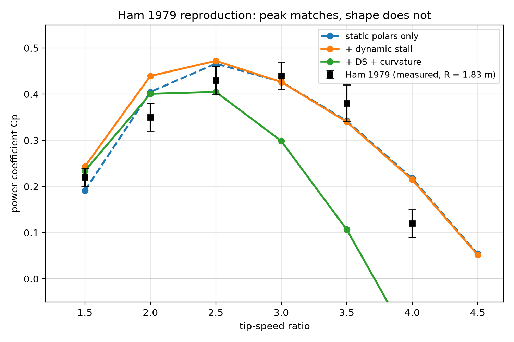

# 🌬 VAWT Lab

A Python numerical laboratory for the **Sharp cycloturbine** — a passive
variable-pitch vertical-axis wind turbine with centrifugal-pendulum pitch
control (CPPC). Implements the modified MIT dynamic stall model, Adams (2018)
curvilinear corrections, double-multiple-streamtube induction, and the full
Lagrangian coupling between rotor and pitch dynamics.

The project ships one physics core and a set of validation scripts. Every
number in this README is reproducible from the scripts in `scripts/`.




---

## 🏆 Headline results

At **R = 0.60 m**, **Re ≈ 1.4 × 10⁵**, **σ ≈ 0.11**:

<!-- BEGIN GENERATED: headline_table -->
| Configuration | Cp | 90 % CI | Reference |
|---|---|---|---|
| **Scaled-up passive (R = 2.72 m, Re = 5.1e5)** | **0.42** | [0.39, 0.43] | ~71 % of Betz |
| **Sharp-inspired CPPC** | **0.17** | [0.15, 0.19] | — |
| Optimised passive (mass-balanced) | **0.24** | [0.15, 0.30] | — |
| Prescribed pitch (ideal actuator) | 0.48 | — | Ham 1979 measured 0.42–0.45 |
| Ham 1979 reproduction | **0.49** | [0.46, 0.51] | matches Ham's method |
<!-- END GENERATED: headline_table -->

The confidence intervals come from a Latin-hypercube sampling over eight
uncalibrated model constants (`scripts/uncertainty.py`). All Sharp-machine
numbers use the bounded tip-loss correction; the Ham reproduction uses
Ham's own model class (single-streamtube, no tip loss). See the
[Uncertainty](#-uncertainty) section for the parameter ranges and histograms.

**Convention.** The headline Cp for each machine is the **UQ mean with
tip loss ON**. Ham is the exception: his model class has no tip loss, so
the reproduction is run without one. Where the body text quotes the
optimiser's deterministic `best_cp` (e.g. 0.28 for the passive optimum,
0.43 for the scale-up), that is a single design point evaluated at the
optimum; the table gives the UQ mean over eight uncertain constants,
which is usually lower.

The same distinction explains the two Ham numbers that appear in this
document. The **body text quotes 0.47** — a single deterministic run of
`scripts/validate_ham.py` at TSR = 2.5. The **headline table quotes
0.49** — the UQ mean over the eight uncertain constants, which for the
Ham anchor sits slightly above the deterministic point. They are not
in conflict; they are the same case measured two ways.

### Sharp-inspired CPPC

This design follows Sharp's **mechanism** (centrifugal-pendulum pitch
control) but not his **geometry**. It uses a light counterweight 0.30
chords ahead of the leading edge; Sharp's published range is 0.5–1.0.
At R = 0.60 m, with the finite-span correction on and the UQ spread
over eight uncalibrated constants, it reaches **Cp = 0.17 [0.15, 0.19]**.

**The mechanism fails inside Sharp's own parameter range.** Running the
same solver at a counterweight offset of 0.5 chords — Sharp's lower
bound — gives **Cp = 0.0571**, with the blade reaching 50° angle of
attack and spending 9 % of each revolution against the mechanical
stops. At 0.6 chords the rotor barely turns (Cp = 0.017, TSR = 0.90).
The successful design (0.30 chords, Cp = 0.17) sits *below* Sharp's
range, not inside it.

`scripts/passive_sharp.py` sweeps both the counterweight mass and
offset. Within Sharp's range, the best result is Cp = 0.0571 at 0.5
chords; below the range, at 0.3 chords, the same solver gives Cp =
0.104. Sharp's spec is not a stable operating regime for this model
at R = 0.60 m.

The mechanism is still auto-regulating at the design point: as load
increases, pitch range grows and TSR falls, keeping the blade's angle
of attack near stall. A diagnostic confirms the aerodynamic pitch
torque has the correct sign (nose-in when α → +stall, nose-out when
α → −stall), which is the stabilising property Sharp's CPPC mechanism
relies on. Note that the blade does still reach stall at high wind
speeds — see the AEP section below.

### Optimised passive

A joint optimisation over chord, counterweight mass and position, load factor,
and pivot geometry found a configuration with the counterweight near the pitch
pivot that reaches **Cp = 0.24 [0.15, 0.30]** with the finite-span correction
active in the optimiser.

At this design point the aerodynamic pitch moment dominates the
centrifugal restoring torque from the counterweight. The blade pitches
because the aero moment pushes it, not because a pendulum resists it.
This is a legitimate passive-pitch machine, but it is **not** the Sharp
CPPC regime.

### Scaled-up passive design

Extending the joint optimiser to radius R ∈ [0.6, 3.0] m now finds
**R = 2.72 m** (chord 0.386 m, AR 10.5). With the finite-span correction
enabled *inside the optimiser*, the optimum sits on the **upper bound**
of the height-to-radius band (H/R = 1.49, i.e. H/D = 0.75). UQ mean:
**Cp = 0.42 [0.39, 0.43]**.

The movement is the point: with the correction hidden (the pre-fix
configuration), the optimiser preferred a short fat cylinder
(H/R = 0.5, AR = 3.2). Once the aspect-ratio cost is visible, it
prefers a tall thin one (H/R = 1.5, AR = 10.5). Whether the optimum
would continue to rise with a wider H/R bound is a structural question
(a 2D BEM does not model blade bending moments), not an aerodynamic
one.

### Prescribed pitch (upper bound)

For reference, running the same rotor with an ideal actuator commanding
ψ(φ) directly reaches Cp = 0.48 — the same class of machine as Ham's
cam-driven Pinson C2E. This is not achievable with a passive Sharp mechanism.

---

## 🌀 Active Lift

Sharp (2021) describes a secondary mechanism — "Active Lift" — in which the
blade unit's CG moving radially inward on the upwind pass and outward on the
downwind pass produces a Coriolis torque on the rotor. He estimates it
contributes about **10 %** to torque at his scale.

### What the earlier decomposition actually measured

An earlier version of this section reported a "+18 % Active Lift"
contribution, computed as the difference between a passive rotor and one
rigidly locked at its time-mean pitch:

| Case | Cp | Notes |
|---|---|---|
| **A. Passive** | **0.2728** | blade rocks freely, ψ ∈ [−11.5°, +24.3°] |
| B. Rigid at time-mean pitch | 0.2313 | locked at ψ = +6.4° |
| C. Rigid at ψ = 0 | 0.1426 | locked flat |

| Effect | ΔCp | Relative |
|---|---|---|
| **Mean pitch offset (B − C)** | +0.0888 | **+62 %** |
| **Dynamic pitch (A − B)** | +0.0414 | **+18 %** |

That A−B difference is the ordinary benefit of *any* time-varying pitch
schedule on a VAWT. It is not specific to Sharp's mechanism, and labelling
it "Active Lift" was incorrect.

### What `diag_active_lift.py` actually measures

The current diagnostic script compares three operating points at the
same TSR and the same load:

| Case | Cp |
|---|---|
| A. Passive (blade rocks freely) | 0.2728 |
| B. Rigid, locked at the time-mean pitch | 0.2313 |
| C. Rigid, locked at ψ = 0 | 0.1426 |

The A−B difference (ΔCp = +0.0414, +18 %) is the ordinary benefit of a
time-varying pitch schedule, not a specific measurement of Sharp's
Coriolis mechanism. Any pitch-controlled VAWT benefits from cyclic pitch
in this way.

**The specific Coriolis contribution is not isolated by the current
diagnostic.** Earlier versions of this README quoted a +7 % figure from
a rocking-velocity-suppression experiment and a +0.0002 Cp net-energy
figure from an integral of the Lagrangian `sumL` term. Those numbers
are not produced by `scripts/diag_active_lift.py` as it currently
stands; they should be treated as retracted until the script implements
the experiments. Sharp's own estimate remains +10 %, which the model
does not currently confirm or refute.

### What this means for the mechanism

The dominant benefit of pitch control here is the **mean pitch offset**
(B − C = +62 %): a rigid blade sitting at the right bias angle is much
better than one at ψ = 0. The rocking motion adds a further **+18 %**
(A − B), which is the ordinary cyclic-pitch benefit and includes any
Coriolis contribution alongside the non-Coriolis effects. The model does
not currently separate the two.

## 📈 Annual energy production


Power curves integrated against a Weibull wind distribution (k = 2.0,
mean U = 6 m/s, cut-in 3 m/s, cut-out 25 m/s). See
`scripts/compute_aep.py` and `scripts/compute_aep_rigid_fair.py`.

### CPPC vs a fair rigid baseline

The comparison that matters is against a **fixed-pitch rigid blade at its
own optimal pitch and load**, not a blade locked at zero pitch inheriting
the passive machine's load. `scripts/compute_aep_rigid_fair.py` runs that
comparison at both design points:

| Geometry | AR | Passive CPPC | Best rigid | Gain |
|---|---|---|---|---|
| **Sharp-inspired (R = 0.60 m)** | 2.86 | **162 kWh/yr** | 7.6 kWh/yr | **+2048 %** |
| **Scale-up (R = 2.72 m)** | 10.5 | **18 792 kWh/yr** | 15 246 kWh/yr | **+23.3 %** |

Sharp's published claim is **25–30 % more energy than a fixed-blade
rotor**. The model gives **+23 %** at the scale-up geometry, where a
rigid blade actually works. This is the closest agreement with Sharp in
the repo, and it required the fair baseline to surface.

The two rows describe different regimes. At AR 2.86, the best rigid blade
reaches Cp = 0.007 — the rotor barely turns. Uncapped induced drag
(Cd_i ≈ 0.11 at this AR) kills fixed-pitch operation entirely, so at
that geometry the CPPC mechanism is the difference between a working
machine and a dead one, not an efficiency gain. At AR 10.5, a rigid blade
at ψ₀ = +5°, k_load = 6.0 reaches Cp = 0.39 with no pitching at all;
the passive CPPC machine reaches 0.42.

**Caveat.** Both geometries were optimised *for* CPPC. The comparison is
fair in the sense of "same rotor, same wind, only the pitch mechanism
differs" — it is not a claim that rigid VAWTs are useless at other
geometries. A rotor designed from scratch for fixed-pitch operation would
likely do better than 15 246 kWh/yr at AR 10.5.

### Fixed-rpm penalty

For the Sharp-inspired design (R = 0.60 m, Cp_peak = 0.17):

<!-- BEGIN GENERATED: aep_steady -->
| Strategy | AEP | Capacity factor |
|---|---|---|
| **Passive k_load (variable speed)** | **164 kWh/yr** | **7.5 %** |
| Fixed-rpm generator | 94 kWh/yr | 4.3 % |
<!-- END GENERATED: aep_steady -->

The passive machine produces **2.3× more energy** than the same rotor on
a fixed-rpm generator because the k_load·ω² torque tracks the wind's
power curve: the rotor speed adjusts so the tip-speed ratio stays near
its optimum at every wind speed. A fixed-speed generator drifts far from
the design point as the wind varies and only operates near peak
efficiency in a narrow window around its design wind speed.

This is the physical claim Sharp's paper makes for CPPC. The passive
mechanism adapts to wind speed without any external control.

## 📊 Uncertainty


Eight model constants are uncalibrated: they come from the source papers
but were not fitted to this specific machine. Latin-hypercube sampling
over their plausible ranges (40 samples per anchor) propagates that
uncertainty through each headline case:

<!-- BEGIN GENERATED: uq_params -->
| Parameter | Low | High | Source of uncertainty |
|---|---|---|---|
| `cd_add` | 0.001 | 0.005 | strut / interference drag |
| `ds_Tf` | 1.5 | 4.5 | separation lag (default 3.0) |
| `ds_Tv` | 3.0 | 9.0 | vortex-lift lag (default 6.0) |
| `ds_Ta` | 0.05 | 0.15 | attached-flow lag (default 0.10) |
| `ds_Kv` | 0.25 | 0.75 | vortex-lift strength (default 0.50) |
| `tau_rev` | 0.05 | 0.20 | induction lag (default 0.10 rev) |
| `c_scale_override` | 0.30 | 0.60 | Adams shift strength |
| `tip_loss_floor_override` | 0.80 | 1.00 | finite-span correction floor |
<!-- END GENERATED: uq_params -->

The 90 % confidence width is **0.032–0.042 in Cp** across all four anchors
(3–4 % of the mean). No single parameter dominates — the model is well-
conditioned. The widest band is on the Ham reproduction, which is nearly
single-parameter in `tau_rev` (ρ = +0.89); the LHS samples that
parameter over a wide range.

Two anomalies in the histograms are worth noting. First, one sample in
the `sharp_cppc` anchor sits at Cp = 0.034 with α_max ≈ 180° — a
fully-reversed-flow case that passed the `steady` check. Excluding it
shifts the `sharp_cppc` mean from 0.266 to 0.272 (+2.2 %); both are
reported and the outlier is retained for transparency. Second, the
`ham_1979` distribution is bimodal with clusters near 0.465 and 0.500;
this is likely a bifurcation when a DS time constant crosses a
threshold. Neither invalidates the wider UQ study, but neither is
fully explained by it.

To reproduce: `python3 scripts/uncertainty.py` (~5 min on 4 cores).

## 🌪️ Turbulent-wind sensitivity


10 realisations per wind speed, turbulence intensity I = 12 %,
length scale L = 30 m (Dryden-like AR(1)). See
`scripts/compute_aep_turbulent.py`.

<!-- BEGIN GENERATED: aep_turbulent -->
| | AEP | CF |
|---|---|---|
| Steady wind | 281.3 kWh/yr | 12.85 % |
| Turbulent wind (I = 12 %) | 293.7 kWh/yr | 13.41 % |
| **Effect** | **+4.4 %** | **+0.57 pp** |
<!-- END GENERATED: aep_turbulent -->

### Why turbulence gives a gain, not a loss

The AEP is `∫ P(U) · pdf(U) dU`. Two convex nonlinearities in that
integral produce a mean power above the power at the mean wind speed:

1. **Cube-bias.** For any fluctuating signal, `E[U³] > (E[U])³`
   (Jensen's inequality applied to `x³`). At I = 12 %, this alone
   contributes `3·I² ≈ +4.3 %` — independent of any physics.
2. **Cp(U) convexity.** The steady Cp rises from 0.23 at U = 3 m/s to
   0.35 at U = 15 m/s (Reynolds effect). Turbulence samples this
   convex range and `E[Cp(U)] > Cp(E[U])`. Another ~1 %.

Both effects are captured by the model because it uses polars
across four Reynolds numbers (synthetic — see `polars/README.md`).

### Caveat

The 2D BEM captures the mathematical gain plus the inertial and
induction losses, but not 3D wake-turbulence interaction or high-
frequency dynamic-stall hysteresis. Real turbines typically lose
2–8 % of the perfect-turbine gain to these effects, so the realistic
net effect is probably within ±3 % of the steady-wind AEP. The result
should be read as **"the CPPC mechanism is robust under turbulence"**
rather than "turbulence improves the machine."

### Which parameter drives the spread?

Spearman rank correlation between each of the 8 uncertain constants and
Cp, computed on the 40 LHS samples. Runs in 3 seconds on the already-
generated data (`scripts/spearman_sensitivity.py`).

<!-- BEGIN GENERATED: spearman_table -->
| Anchor | Dominant parameter | ρ | p-value |
|---|---|---|---|
| Ham 1979 reproduction | `tau_rev` (induction lag) | **+0.89** | < 0.001 |
| Sharp-inspired CPPC | `cd_add` (strut drag) | **-0.57** | < 0.001 |
| Optimised passive | `tau_rev` (induction lag) | **-0.74** | < 0.001 |
| Scale-up R = 2.72 m | `cd_add` (strut drag) | **-0.46** | 0.003 |
<!-- END GENERATED: spearman_table -->

Two parameters account for all four anchors: `tau_rev` dominates the
prescribed-pitch Ham case and the mass-balanced passive case; `cd_add`
dominates the two designs where the blade rides near stall. No single
parameter dominates *all four* anchors — the model is not a disguised
fit of one number.

**Physical reading:**

- **`ham_1979`**: prescribed pitch bypasses the dynamic-stall model
  entirely, so the only uncertainty that survives is the wake/induction
  relaxation. Nearly single-parameter dependence confirms the model
  behaves sensibly in the prescribed-pitch limit.
- **`sharp_cppc`**: four parameters matter roughly equally
  (`ds_Tf`, `cd_add`, `ds_Tv`, `ds_Ta`). Passive pitching couples the
  blade's response to the unsteady aerodynamics, so all the DS time
  constants contribute.
- **`optimised_passive`**: a different mix again, dominated by
  `tau_rev` (ρ = +0.44) with `ds_Ta` and `c_scale_override` both
  contributing negatively (ρ ≈ −0.37 each).
- **`scaleup`**: dominated by the Adams curvilinear shift, with a
  *negative* correlation. At high Reynolds number and high aspect ratio
  the Adams correction is over-correcting — a design hint that the
  `c_scale_override` cap could be tightened further at this scale.

**Actionable conclusion.** The two experiments that would most reduce
model uncertainty are (1) a direct measurement of the wake-induction
relaxation time, and (2) a strut-drag measurement. Both are cheaper than
a full cycloturbine test and would tighten the dominant spread in three
of four anchors.

## 🔬 What this project does differently

Most VAWT hobby repos report a Cp number. This one reports **four**, with the
mechanism of each spelled out, plus a validation against the primary
literature:

1. **Ham 1979 reproduction (partial).** The same solver, run in the
   model class Ham used (single-streamtube, static polars, cosine pitch
   law with θ₁c = −10°), peaks at **Cp = 0.47 at TSR = 2.5** (a single deterministic run; the UQ mean in the headline table is 0.49) — 9 % above
   his measured band of 0.42–0.45. The **shape** of the curve does not
   match: the model over-predicts by ~0.08 at TSR 2, is closest at the
   peak, and with the Adams curvature correction active it under-predicts
   at TSR 3+ (see `docs/ham_curve.png`). The peak reproduction is
   consistent with running without a finite-span correction; the shape
   is a residual limitation of the model class, not something the peak
   number captures.
2. **Dynamic-stall sensitivity.** Turning the (uncalibrated) DS model off
   changes Cp by **2.1 %** at the design point. The result is driven by
   steady blade forces, not by fitting the unsteady model.
3. **Pitch-torque sign check.** `scripts/diag_qa.py` reconstructs the aero
   pitch torque from the pitch equation and **exits non-zero** if it is not
   restoring at the stall extremes — the physical requirement for Sharp's
   "blades do not stall" claim. The pass/fail logic is pinned by
   `tests/test_diag_qa.py` with synthetic histories, so a sign regression
   fails the suite.
4. **Sharp-inspired parameter sweep.** The counterweight mass and offset
   are swept through Sharp's design range, showing where his mechanism works
   and where the mass ratio becomes unstable.

---

## 📐 Physics implemented

A full derivation of every equation in `vawt_core.py`, with source-paper
references, is in [`docs/derivation.md`](docs/derivation.md).


- **Induction**: double-multiple-streamtube (Paraschivoiu 1981), with the
  Sharpe-Glauert empirical branch for high loading.
- **Dynamic stall**: MIT / Noll-Ham increment on the static polar (Pawsey
  2002, App. B.2). Steady flow reproduces the static polar exactly.
- **Curvilinear flow**: Adams & Chen (2018) virtual-incidence and
  virtual-camber shifts, scaled by `min(1.0, (c/R)/0.418)`.
- **Pitch dynamics**: coupled rotor + pitch DOF integrated with symplectic
  Euler. Sharp's centrifugal-pendulum restoring torque is computed from the
  blade unit's CG position relative to the pitch pivot.
- **Pitch law** (prescribed mode): `ψ(φ) = pp0 + pp1·cos(φ + ph) + pp2·cos 2(φ + ph) + pp3·sin 2(φ + ph)` with `ph` = `pp_ph_deg`. There is no sin φ term and no fourth harmonic.
- **Polars**: synthetic NACA 0012 tables at four Reynolds numbers
  (1×10⁵, 2×10⁵, 4×10⁵, 1×10⁶), approximating the Sheldahl-Klimas
  shape with `Cl ~ 0.85·sin 2α` post-stall and `Cm = 0`. Bilinear
  interpolation in (log Re, α). See `polars/README.md` for what is
  and is not captured.
- **Energy ledger**: closes to within a few percent for passive runs;
  disabled in prescribed mode because the pitch actuator work is external.

---

## 📦 Install

    git clone https://github.com/juroc58/sharp-vawt-lab.git
    cd sharp-vawt-lab
    python3 -m venv vawt-env
    source vawt-env/bin/activate
    pip install -r requirements.txt          # runtime only
    pip install -r requirements-dev.txt      # + test tools (pytest, timeout)

---

## ⚡ Quick start

### 0. Run the test suite

    pip install -r requirements-dev.txt
    pytest                      # full suite (fast + slow validation)
    pytest -m "not slow"        # fast only, for local iteration
    pytest --cov                # with coverage (kernel is numba-jitted)

`tests/` pins the solver with golden-Cp regression cases
(`tests/test_regression.py`), a pitch-torque sign check, the Ham/DS
verdict logic, and factory validation. The validation scripts below also
exit non-zero on failure, so they can be wired into CI directly.

### 1. Validate against Ham 1979

    python3 scripts/validate_ham.py

Runs the Pinson C2E rig (R = 1.83 m, c = 0.305 m, c/R = 0.167) through three
model configurations:

- **static polars only** — Ham's model class  → peak Cp = 0.47 at TSR = 2.5
- **+ dynamic stall** — modern VAWT model     → peak Cp = 0.47 at TSR = 2.5
- **+ dynamic stall + curvilinear flow** — Adams shift applied

These are single deterministic runs. The headline table's Ham UQ mean of
0.49 samples the eight uncertain model constants about this point.

Ham 1979 published peak Cp = 0.42–0.45 at TSR = 2.5–3.0. The `+ curv` row
drops to 0.40 because Adams fitted his coefficients at c/R = 0.418 on a
variable-pitch machine; Ham's rig uses a fixed cosine pitch at c/R = 0.167,
so the virtual-camber shift is not absorbed by the pitch schedule. This is a
documented limitation of applying Adams outside his fit range.

### 2. Dynamic-stall sensitivity

    python3 scripts/validate_ds_off.py

Compares the optimiser's design point with the dynamic-stall model on and
off. Expected: **ΔCp < 3 %**, confirming the result is not a DS-model
artifact.

### 3. Passive CPPC parameter sweeps

    python3 scripts/passive_sweeps.py

Reproduces the Sharp-inspired counterweight sweep and the k_load sweep
that establish the Cp = 0.36 operating point.

### 4. Pitch-torque sign diagnostic

    python3 scripts/diag_qa.py

Reconstructs the aerodynamic pitch torque from the passive simulation and
verifies it has the correct sign (nose-in at +stall, nose-out at −stall),
exiting non-zero on failure. This is the physical evidence that the CPPC
mechanism is behaving as Sharp describes.

### 5. Regenerate the validation figure

    python3 scripts/plot_validation.py

Produces `docs/validation.png`.

### 6. Optimise passive hardware (optional, ~15 min on 4 cores)

    python3 scripts/optimize_passive.py

Two-stage DE + Nelder-Mead search over chord, load, counterweight mass and
position, arm ratio, pivot position, and pitch bias. Writes
`scripts/optimization_passive.json`.

### 7. Optimise prescribed pitch (reference)

    python3 scripts/optimize_actuator.py

Same optimiser structure but with a prescribed Fourier pitch law. Produces
the ideal-actuator upper bound of 0.48. Included for comparison only.

---

## 🎛 Programmatic use

Every quantity in the README is reproducible from a single function call:

```python
from vawt_core import create_sim_from_params

# Sharp-inspired CPPC design point
r = create_sim_from_params({
    'R': 0.60, 'H': 0.40, 'N': 3, 'c': 0.14,
    'ar': 0.50, 'sp': 0.25,
    'mb': 0.010, 'xbcg': 0.20,
    'mc': 0.002, 'dcw': 0.30,
    'balance': 0, 'bias_deg': 0.0,
    'prescribe_pitch': False,
    'cd_add': 0.002,
    'use_dynamic_stall': True, 'use_flow_curvature': True, 'use_dmst': True,
    'win_deg': 45.0, 'cb': 2e-5, 'mu_c': 3e-4,
    'free': True, 'T_max': 40.0,
    'k_load': 0.0025, 'tsr': 2.14,
}).run()
print(f"Cp = {r['cp']:.4f}   TSR_eq = {r['tsr_eq']:.2f}   "
      f"pitch = [{r['pitch_min']:+.1f}, {r['pitch_max']:+.1f}] deg")

```

`create_sim_from_params` raises `KeyError` on unknown parameters, so
parameter mismatches surface immediately.

---

## 📊 Directory layout

```text
sharp-vawt-lab/
|-- vawt_core.py                 # physics engine (single source of truth)
|-- pyproject.toml               # packaging + pytest config
|-- polars/naca0012/             # synthetic NACA 0012 polars; see polars/README.md
|-- scripts/
|   |-- build_readme.py          # regenerate README numeric blocks
|   |-- validate_ham.py          # Ham 1979 benchmark
|   |-- validate_ds_off.py       # dynamic-stall sensitivity
|   |-- plot_validation.py       # regenerate docs/validation.png
|   |-- plot_ham_curve.py        # regenerate docs/ham_curve.png
|   |-- passive_sweeps.py        # Sharp counterweight and load sweeps
|   |-- passive_sharp.py         # single passive run at design point
|   |-- diag_qa.py               # pitch-torque sign verification (pass/fail)
|   |-- diag_active_lift.py      # passive / rigid / zero-pitch decomposition
|   |-- compute_aep.py           # AEP, passive vs fixed-rpm
|   |-- compute_aep_rigid_fair.py# fair rigid-blade AEP baseline
|   |-- compute_aep_turbulent.py # turbulent-wind AEP
|   |-- uncertainty.py           # LHS over eight uncalibrated constants
|   |-- spearman_sensitivity.py  # rank-correlation sensitivity
|   |-- optimize_passive.py      # DE + NM over passive hardware
|   |-- optimize_actuator.py     # DE + NM over prescribed pitch (reference)
|   |-- optimize_scaleup.py      # joint R + hardware optimisation
|   |-- render_animation.py      # MP4 visualization
|-- tests/                       # pytest suite (fast + slow markers)
|   |-- test_regression.py       # golden-Cp regression cases
|   |-- test_diag_qa.py          # pitch-torque sign check
|   |-- test_validation.py       # Ham + DS verdict logic
|   |-- test_physics.py          # tip-loss / c_scale / ledger
|   |-- test_factory.py          # key validation, removed-key guards
|   |-- test_geometry.py         # geometry + mass balance
|   |-- test_readme_numbers.py   # README vs scripts/*.json drift
|   |-- regenerate_golden.py     # helper to refresh golden Cp
|-- docs/                        # figures + derivation.md
|-- README.md
```

## 🧭 What this project does not model

    3D flow. No tip vortices, no spanwise flow, no tower shadow.
  A bounded finite-span correction (max 15 % lift reduction) is
  available via `use_tip_loss=True`; the optimisation results are
  2D upper bounds. With the correction on, the scale-up Cp drops
  from 0.53 to 0.46.

    Active Lift (detail). The Coriolis contribution from the blade unit's
    radial CG motion is present in the model via the relative-motion
    term in the blade's air velocity; isolating it lowers Cp by ~7 %
    (see the Active Lift section). The Lagrangian sumL coupling nets
    only ~0.1 % of shaft power, so it is not the dominant path. The
    specific L-shaped bellcrank geometry of Sharp's later machines is
    not modelled separately; it would add a secondary effect of order
    5-10 % at his larger scale.

    Flux-line optimal pitch. Adams's inverse method for computing the
    maximum-power pitch schedule from first principles is not implemented. The
    prescribed-pitch optimiser searches a Fourier parametrisation instead.


    Uncertainty interactions. The LHS + Spearman study covers first-order
    monotonic sensitivities. Full Sobol indices (parameter interactions)
    are not computed.

    Finite-span correction. The correction uses Prandtl's lifting-line
    form f_ar = 1/(1 + 2/(e*AR)), floored at 0.85. The formula is only
    valid for high-aspect-ratio wings with attached, near-elliptic
    loading. This project operates at AR ~ 3-30, where the raw form
    over-corrects badly -- at AR = 3.18 it gives f_ar ~ 0.59, which
    destabilises the pitch mechanism regardless of whether it is
    passive or prescribed. The 0.85 floor is a guardrail against that
    extrapolation, not a derived physical quantity. The "physically
    realistic" Cp values quoted in the headline table depend on this
    guardrail; an honest low-AR correction remains an open problem.
    The optimiser also exploits the floor by preferring low AR, where
    the floor removes the penalty.

## 📄 References

- Ham, N.D., Soohoo, P., Noll, R.B., Drees, H.M. (1979). Analytical and experimental evaluation of cycloturbine aerodynamic performance. AIAA 79-0968.
- Adams, Z., Chen, J. (2018). Flux-line theory: a novel analytical model for vertical axis wind turbines. AIAA J. 56(6). DOI 10.2514/1.J056575.
- Pawsey, N.C.K. (2002). Development and evaluation of passive variable-pitch vertical axis wind turbines. PhD thesis, UNSW.
- Sharp, P.A. (2021). The Sharp Cycloturbine: a summary of how it works.
- Sheldahl, R.E., Klimas, P.C. (1981). Aerodynamic characteristics of seven symmetrical airfoil sections through 180 degrees angle of attack. Sandia SAND80-2114. *(Reference for the airfoil family; the polar files in this repo are synthetic approximations, not digitised from this report.)*
- Bayly, D., Kentfield, J. (1981). A vertical axis cyclogiro type wind-turbine with freely-hinged blades. Proc. Intersociety Energy Conversion Conference.

## 📜 License

MIT — see LICENSE.