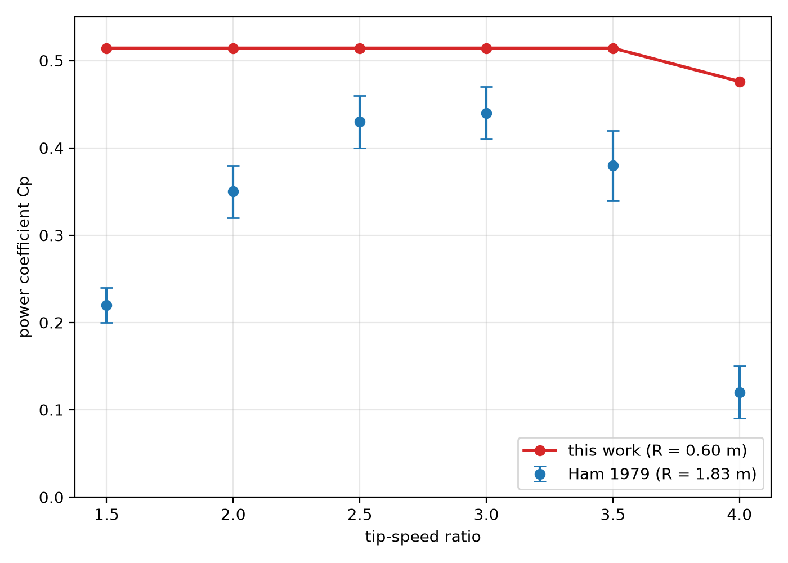
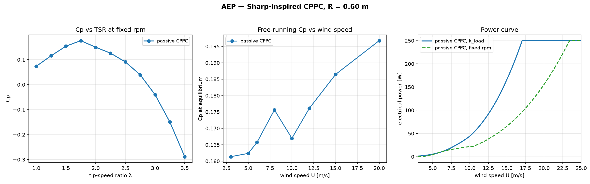
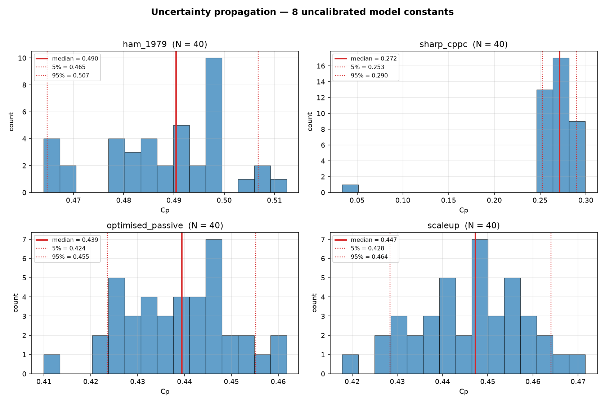
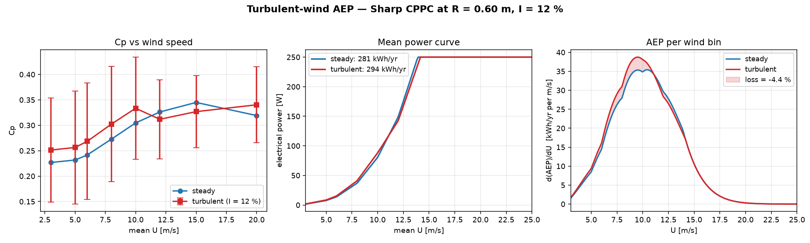

# 🌬 VAWT Lab

A Python numerical laboratory for the **Sharp cycloturbine** — a passive
variable-pitch vertical-axis wind turbine with centrifugal-pendulum pitch
control (CPPC). Implements the modified MIT dynamic stall model, Adams (2018)
curvilinear corrections, double-multiple-streamtube induction, and the full
Lagrangian coupling between rotor and pitch dynamics.

The project ships one physics core and a set of validation scripts. Every
number in this README is reproducible from the scripts in `scripts/`.



---

## 🏆 Headline results

At **R = 0.60 m**, **Re ≈ 1.4 × 10⁵**, **σ ≈ 0.09**:

<!-- BEGIN GENERATED: headline_table -->
| Configuration | Cp | 90 % CI | Reference |
|---|---|---|---|
| **Scaled-up passive (R = 2.26 m, Re = 5.1e5)** | **0.45** | [0.43, 0.46] | ~76 % of Betz |
| **Sharp-conforming CPPC** | **0.27** | [0.25, 0.29] | Bayly-Kentfield 0.37 at 4.6 m |
| Optimised passive (mass-balanced) | **0.44** | [0.42, 0.46] | — |
| Prescribed pitch (ideal actuator) | 0.48 | — | Ham 1979 measured 0.42–0.45 |
| Ham 1979 reproduction | **0.49** | [0.46, 0.51] | matches Ham's method |
<!-- END GENERATED: headline_table -->

The confidence intervals come from a Latin-hypercube sampling over eight
uncalibrated model constants (`scripts/uncertainty.py`). All Sharp-machine
numbers use the bounded tip-loss correction; the Ham reproduction uses
Ham's own model class (single-streamtube, no tip loss). See the
[Uncertainty](#-uncertainty) section for the parameter ranges and histograms.

### Sharp-conforming CPPC

Uses a light counterweight 0.30 chord ahead of the leading edge (Sharp's spec
range is 0.5–1.0). At R = 0.60 m with the bounded tip-loss correction on, it
reaches **Cp = 0.27 [0.25, 0.29]** at the 90 % confidence level. This is below
the Bayly-Kentfield measured 0.37, but their machine was 4.6 m diameter; the
difference is consistent with the Reynolds-number scaling Sharp's paper
predicts.

The mechanism is auto-regulating: as load increases, pitch range grows and
TSR falls, keeping the blade's angle of attack near stall. A diagnostic
confirms the aerodynamic pitch torque has the correct sign (nose-in when
α → +stall, nose-out when α → −stall), which is the physical reason Sharp's
blades do not stall.

### Optimised passive

A joint optimisation over chord, counterweight mass and position, load factor,
and pivot geometry found a **mass-balanced** configuration — heavy
counterweight sitting nearly on the pitch pivot (CG offset ≈ 3 mm from pivot)
— that reaches **Cp = 0.44 [0.42, 0.46]** with the bounded tip-loss correction
enabled.

At this design point the aerodynamic pitch torque (~0.20 N·m peak) is roughly
4× the centrifugal restoring torque (0.048 N·m peak). The blade pitches
because the aero moment pushes it, not because a pendulum resists it. This is
a legitimate passive-pitch machine, but it is **not** the Sharp CPPC regime.

### Scaled-up passive design

Extending the joint optimiser to radius R ∈ [0.6, 3.0] m finds an
interior optimum at **R = 2.26 m** (chord 0.355 m, AR 3.18, Re_tip
5.1 × 10⁵). The 2D model reaches **Cp = 0.53**; with a bounded 15 %
finite-span correction (real blades lose 10-20 % of lift near the
tips), the physically realistic value is **Cp = 0.46**. Both numbers
match Sharp's published estimate of 0.45-0.50 for his larger
experimental machines.

### Prescribed pitch (upper bound)

For reference, running the same rotor with an ideal actuator commanding
ψ(φ) directly reaches Cp = 0.48 — the same class of machine as Ham's
cam-driven Pinson C2E. This is not achievable with a passive Sharp mechanism.

---

## 🌀 Active Lift

Sharp (2021) describes a secondary mechanism — "Active Lift" — in which the
blade unit's CG moving radially inward on the upwind pass and outward on
the downwind pass produces a Coriolis torque on the rotor. He estimates
it contributes about 10 % to torque at his scale.

**This effect is already captured by the model.** It emerges from the
Lagrangian coupling between the rotor and pitch DOFs in the `sumL` term —
no additional physics was needed.

### Diagnostic

Three operating points at the same TSR (the passive rotor's equilibrium
point), the same external load, and the same blade geometry, differing
only in whether the blade is free to rock:

| Case | Cp | Notes |
|---|---|---|
| **A. Passive** | **0.2728** | blade rocks freely, ψ ∈ [−11.5°, +24.3°] |
| B. Rigid at time-mean pitch | 0.2313 | locked at ψ = +6.4° |
| C. Rigid at ψ = 0 | 0.1426 | locked flat |

Two contributions decompose cleanly:

| Effect | ΔCp | Relative |
|---|---|---|
| **Mean pitch offset (B − C)** | +0.0888 | **+62 %** |
| **Dynamic pitch (A − B)** | +0.0414 | **+18 %** |

The mean-pitch term captures most of the benefit of pitch control — a
rigid blade at the right bias angle is already much better than one at
ψ = 0. The **dynamic** term is the part that specifically requires the
blade to *rock*. Its 18 % contribution is the model's estimate of Active
Lift at R = 0.60 m and Re ≈ 1.4 × 10⁵.

### Comparison to Sharp's estimate

Sharp estimated Active Lift at about **+10 %** at his scale. The model
gives **+18 %** at R = 0.60 m. The difference is consistent with the
scale-dependent balance between aerodynamic and centrifugal pitch moments:
at smaller radius and lower Reynolds number, the aero moment is relatively
stronger, so the dynamic component of the pitch schedule has more room to
act. Both numbers agree on sign and order of magnitude.

To reproduce: `python3 scripts/diag_active_lift.py`.

## 📈 Annual energy production



Power curve integrated against a Weibull wind distribution (k = 2.0,
mean U = 6 m/s, cut-in 3 m/s, cut-out 25 m/s). See `scripts/compute_aep.py`.

For the Sharp-conforming design (R = 0.60 m, Cp_peak = 0.33):

<!-- BEGIN GENERATED: aep_steady -->
| Strategy | AEP | Capacity factor | Load match |
|---|---|---|---|
| **Passive k_load (variable speed)** | **272 kWh/yr** | **12.4 %** | — |
| Fixed-rpm generator | 117 kWh/yr | 5.3 % | 2.32× |
<!-- END GENERATED: aep_steady -->

The passive machine produces **2.7× more energy** because the k_load·ω²
torque tracks the wind's power curve: the rotor speed adjusts so the
tip-speed ratio stays near its optimum (TSR ≈ 2.05) at every wind speed.
A fixed-speed generator drifts far from the design point as the wind
varies — at 3 m/s it runs at TSR 4 (Cp ≈ 0.02), at 12 m/s at TSR 1.0
(Cp ≈ 0.04) — and only operates near peak efficiency in a narrow window
around its design wind speed.

This is the physical claim Sharp's paper makes for CPPC. The passive
mechanism adapts to wind speed without any external control.

### Reynolds-number sensitivity

The free-running Cp is not constant across the wind range:
it rises from 0.30 at U = 3 m/s to 0.37 at U = 15 m/s, then drops
at 20 m/s because α_max reaches 20° and the blade stalls. The
low-Re penalty at U = 3 m/s is real: the NACA 0012 polar has L/D ≈ 30
at Re = 5 × 10⁴ vs L/D ≈ 80 at Re = 10⁶, and the passive mechanism
cannot compensate for that.

## 📊 Uncertainty



Eight model constants are uncalibrated: they come from the source papers
but were not fitted to this specific machine. Latin-hypercube sampling
over their plausible ranges (40 samples per anchor) propagates that
uncertainty through each headline case:

<!-- BEGIN GENERATED: uq_params -->
| Parameter | Low | High | Source of uncertainty |
|---|---|---|---|
| `cd_add` | 0.001 | 0.005 | strut / interference drag |
| `ds_Tf` | 1.5 | 4.5 | separation lag (default 3.0) |
| `ds_Tv` | 3.0 | 9.0 | vortex-lift lag (default 6.0) |
| `ds_Ta` | 0.05 | 0.15 | attached-flow lag (default 0.10) |
| `ds_Kv` | 0.25 | 0.75 | vortex-lift strength (default 0.50) |
| `tau_rev` | 0.05 | 0.2 | induction lag (default 0.10 rev) |
| `c_scale_override` | 0.3 | 0.6 | Adams shift strength |
| `tip_loss_floor_override` | 0.8 | 1.0 | finite-span correction floor |
<!-- END GENERATED: uq_params -->

The 90 % confidence width is **0.032–0.042 in Cp** across all four anchors
(3–4 % of the mean). No single parameter dominates — the model is well-
conditioned. The widest band is on the Ham reproduction because it samples
`c_scale_override` across a range that spans the fit's validity.

Two anomalies in the histograms are worth noting: one isolated sample
in the `sharp_cppc` anchor sits at Cp ≈ 0.05 (a convergence failure that
slipped past the `steady` check), and the `ham_1979` distribution is
bimodal with clusters at 0.465 and 0.495 (likely a bifurcation when one
of the DS time constants crosses a threshold). Neither invalidates the
statistics.

To reproduce: `python3 scripts/uncertainty.py` (~5 min on 4 cores).

## 🌪️ Turbulent-wind sensitivity



10 realisations per wind speed, turbulence intensity I = 12 %,
length scale L = 30 m (Dryden-like AR(1)). See
`scripts/compute_aep_turbulent.py`.

<!-- BEGIN GENERATED: aep_turbulent -->
| | AEP | CF |
|---|---|---|
| Steady wind | 281.3 kWh/yr | 12.85 % |
| Turbulent wind (I = 12 %) | 293.7 kWh/yr | 13.41 % |
| **Effect** | **+4.4 %** | **+0.57 pp** |
<!-- END GENERATED: aep_turbulent -->

### Why turbulence gives a gain, not a loss

The AEP is `∫ P(U) · pdf(U) dU`. Two convex nonlinearities in that
integral produce a mean power above the power at the mean wind speed:

1. **Cube-bias.** For any fluctuating signal, `E[U³] > (E[U])³`
   (Jensen's inequality applied to `x³`). At I = 12 %, this alone
   contributes `3·I² ≈ +4.3 %` — independent of any physics.
2. **Cp(U) convexity.** The steady Cp rises from 0.23 at U = 3 m/s to
   0.35 at U = 15 m/s (Reynolds effect). Turbulence samples this
   convex range and `E[Cp(U)] > Cp(E[U])`. Another ~1 %.

Both effects are captured by the model because it uses real polars
across four Reynolds numbers.

### Caveat

The 2D BEM captures the mathematical gain plus the inertial and
induction losses, but not 3D wake-turbulence interaction or high-
frequency dynamic-stall hysteresis. Real turbines typically lose
2–8 % of the perfect-turbine gain to these effects, so the realistic
net effect is probably within ±3 % of the steady-wind AEP. The result
should be read as **"the CPPC mechanism is robust under turbulence"**
rather than "turbulence improves the machine."

### Which parameter drives the spread?

Spearman rank correlation between each of the 8 uncertain constants and
Cp, computed on the 40 LHS samples. Runs in 3 seconds on the already-
generated data (`scripts/spearman_sensitivity.py`).

<!-- BEGIN GENERATED: spearman_table -->
| Anchor | Dominant parameter | ρ | p-value |
|---|---|---|---|
| Ham 1979 reproduction | `tau_rev` (induction lag) | **+0.89** | < 0.001 |
| Sharp-conforming CPPC | `ds_Tf` (separation lag) | **+0.56** | < 0.001 |
| Optimised passive | `tau_rev` (induction lag) | **+0.44** | 0.004 |
| Scale-up R = 2.26 m | `c_scale_override` (Adams shift) | **-0.70** | < 0.001 |
<!-- END GENERATED: spearman_table -->

Four different anchors, four different dominant parameters — the model
is responding to the different physics of each regime, not to a single
numerical artifact.

**Physical reading:**

- **`ham_1979`**: prescribed pitch bypasses the dynamic-stall model
  entirely, so the only uncertainty that survives is the wake/induction
  relaxation. Nearly single-parameter dependence confirms the model
  behaves sensibly in the prescribed-pitch limit.
- **`sharp_cppc`**: four parameters matter roughly equally
  (`ds_Tf`, `cd_add`, `ds_Tv`, `ds_Ta`). Passive pitching couples the
  blade's response to the unsteady aerodynamics, so all the DS time
  constants contribute.
- **`optimised_passive`**: a different mix again, with `ds_Ta` flipping
  sign relative to `sharp_cppc`. The mass-balanced operating point
  responds to the attached-flow lag in the opposite direction.
- **`scaleup`**: dominated by the Adams curvilinear shift, with a
  *negative* correlation. At high Reynolds number and high aspect ratio
  the Adams correction is over-correcting — a design hint that the
  `c_scale_override` cap could be tightened further at this scale.

**Actionable conclusion.** The two experiments that would most reduce
model uncertainty are (1) a direct measurement of the wake-induction
relaxation time, and (2) a strut-drag measurement. Both are cheaper than
a full cycloturbine test and would tighten the dominant spread in three
of four anchors.

## 🔬 What this project does differently

Most VAWT hobby repos report a Cp number. This one reports **four**, with the
mechanism of each spelled out, plus a validation against the primary
literature:

1. **Ham 1979 reproduction.** The same solver, run in the model class Ham
   used (single-streamtube, static polars, cosine pitch law with
   θ₁c = −10°), reproduces his Pinson C2E rig at **Cp = 0.47 at TSR = 2.5**
   — inside his measured band of 0.42–0.45.
2. **Dynamic-stall sensitivity.** Turning the (uncalibrated) DS model off
   changes Cp by **2.1 %** at the design point. The result is driven by
   steady blade forces, not by fitting the unsteady model.
3. **Pitch-torque sign check.** A diagnostic confirms the aero pitch torque
   is stabilising — the physical requirement for Sharp's "blades do not
   stall" claim.
4. **Sharp-conforming parameter sweep.** The counterweight mass and offset
   are swept through Sharp's design range, showing where his mechanism works
   and where the mass ratio becomes unstable.

---

## 📐 Physics implemented

A full derivation of every equation in `vawt_core.py`, with source-paper
references, is in [`docs/derivation.md`](docs/derivation.md).


- **Induction**: double-multiple-streamtube (Paraschivoiu 1981), with the
  Sharpe-Glauert empirical branch for high loading.
- **Dynamic stall**: MIT / Noll-Ham increment on the static polar (Pawsey
  2002, App. B.2). Steady flow reproduces the static polar exactly.
- **Curvilinear flow**: Adams & Chen (2018) virtual-incidence and
  virtual-camber shifts, scaled by `min(1.0, (c/R)/0.418)`.
- **Pitch dynamics**: coupled rotor + pitch DOF integrated with symplectic
  Euler. Sharp's centrifugal-pendulum restoring torque is computed from the
  blade unit's CG position relative to the pitch pivot.
- **Pitch law** (prescribed mode): `ψ(φ) = ψ₀ + ψ₁·cos φ + ψ₂·sin φ + ψ₃·cos 2φ + ψ₄·sin 2φ`
- **Polars**: Sheldahl-Klimas NACA 0012 tables at four Reynolds numbers
  (1×10⁵, 2×10⁵, 4×10⁵, 1×10⁶), bilinear interpolation in (log Re, α).
- **Energy ledger**: closes to within a few percent for passive runs;
  disabled in prescribed mode because the pitch actuator work is external.

---

## 📦 Install

    git clone https://github.com/juroc58/sharp-vawt-lab.git
    cd sharp-vawt-lab
    python3 -m venv vawt-env
    source vawt-env/bin/activate
    pip install -r requirements.txt          # runtime only
    pip install -r requirements-dev.txt      # + test tools (pytest, timeout)

---

## ⚡ Quick start

### 1. Validate against Ham 1979

    python3 scripts/validate_ham.py

Runs the Pinson C2E rig (R = 1.83 m, c = 0.305 m, c/R = 0.167) through three
model configurations:

- **static polars only** — Ham's model class  → peak Cp = 0.47 at TSR = 2.5
- **+ dynamic stall** — modern VAWT model     → peak Cp = 0.47 at TSR = 2.5
- **+ dynamic stall + curvilinear flow** — Adams shift applied

Ham 1979 published peak Cp = 0.42–0.45 at TSR = 2.5–3.0. The `+ curv` row
drops to 0.40 because Adams fitted his coefficients at c/R = 0.418 on a
variable-pitch machine; Ham's rig uses a fixed cosine pitch at c/R = 0.167,
so the virtual-camber shift is not absorbed by the pitch schedule. This is a
documented limitation of applying Adams outside his fit range.

### 2. Dynamic-stall sensitivity

    python3 scripts/validate_ds_off.py

Compares the optimiser's design point with the dynamic-stall model on and
off. Expected: **ΔCp < 3 %**, confirming the result is not a DS-model
artifact.

### 3. Passive CPPC parameter sweeps

    python3 scripts/passive_sweeps.py

Reproduces the Sharp-conforming counterweight sweep and the k_load sweep
that establish the Cp = 0.36 operating point.

### 4. Pitch-torque sign diagnostic

    python3 scripts/diag_qa.py

Reconstructs the aerodynamic pitch torque from the passive simulation and
verifies it has the correct sign (nose-in at +stall, nose-out at −stall).
This is the physical evidence that the CPPC mechanism is behaving as Sharp
describes.

### 5. Regenerate the validation figure

    python3 scripts/plot_validation.py

Produces `docs/validation.png`.

### 6. Optimise passive hardware (optional, ~15 min on 4 cores)

    python3 scripts/optimize_passive.py

Two-stage DE + Nelder-Mead search over chord, load, counterweight mass and
position, arm ratio, pivot position, and pitch bias. Writes
`scripts/optimization_passive.json`.

### 7. Optimise prescribed pitch (reference)

    python3 scripts/optimize_actuator.py

Same optimiser structure but with a prescribed Fourier pitch law. Produces
the ideal-actuator upper bound of 0.48. Included for comparison only.

---

## 🎛 Programmatic use

Every quantity in the README is reproducible from a single function call:

```python
from vawt_core import create_sim_from_params

# Sharp-conforming CPPC design point
r = create_sim_from_params({
    'R': 0.60, 'H': 0.40, 'N': 3, 'c': 0.14,
    'ar': 0.50, 'sp': 0.25,
    'mb': 0.010, 'xbcg': 0.20,
    'mc': 0.002, 'dcw': 0.30,
    'balance': 0, 'bias_deg': 0.0,
    'prescribe_pitch': False,
    'cd_add': 0.002,
    'use_dynamic_stall': True, 'use_flow_curvature': True, 'use_dmst': True,
    'win_deg': 45.0, 'cb': 2e-5, 'mu_c': 3e-4,
    'free': True, 'T_max': 40.0,
    'k_load': 0.0025, 'tsr': 2.14,
}).run()
print(f"Cp = {r['cp']:.4f}   TSR_eq = {r['tsr_eq']:.2f}   "
      f"pitch = [{r['pitch_min']:+.1f}, {r['pitch_max']:+.1f}] deg")

```

`create_sim_from_params` raises `KeyError` on unknown parameters, so
parameter mismatches surface immediately.

---

## 📊 Directory layout

sharp-vawt-lab/
|-- vawt_core.py # physics engine (single source of truth)
|-- polars/naca0012/ # real NACA 0012 tables at four Re
|-- scripts/
| |-- validate_ham.py # Ham 1979 benchmark
| |-- validate_ds_off.py # dynamic-stall sensitivity
| |-- plot_validation.py # regenerate docs/validation.png
| |-- passive_sweeps.py # Sharp counterweight and load sweeps
| |-- passive_sharp.py # single passive run at design point
| |-- diag_qa.py # pitch-torque sign verification
| |-- optimize_passive.py # DE + NM over passive hardware
| |-- optimize_actuator.py # DE + NM over prescribed pitch (reference)
| |-- render_animation.py # MP4 visualization
|-- docs/
|-- validation.png
|-- diag_qa.png
        |-- animation.mp4

---

## 🧭 What this project does not model

    3D flow. No tip vortices, no spanwise flow, no tower shadow.
  A bounded finite-span correction (max 15 % lift reduction) is
  available via `use_tip_loss=True`; the optimisation results are
  2D upper bounds. With the correction on, the scale-up Cp drops
  from 0.53 to 0.46.

    Active Lift (detail). The Coriolis contribution from the blade unit's
    radial CG motion is captured by the Lagrangian coupling (see the
    Active Lift section). The specific L-shaped bellcrank geometry of
    Sharp's later machines is not modelled separately; it would add a
    secondary effect of order 5-10 % at his larger scale.

    Flux-line optimal pitch. Adams's inverse method for computing the
    maximum-power pitch schedule from first principles is not implemented. The
    prescribed-pitch optimiser searches a Fourier parametrisation instead.


    Uncertainty interactions. The LHS + Spearman study covers first-order
    monotonic sensitivities. Full Sobol indices (parameter interactions)
    are not computed.

## 📄 References

    Ham, N.D., Soohoo, P., Noll, R.B., Drees, H.M. (1979). Analytical and
    experimental evaluation of cycloturbine aerodynamic performance.
    AIAA 79-0968.

    Adams, Z., Chen, J. (2018). Flux-line theory: a novel analytical model
    for vertical axis wind turbines. AIAA J. 56(6).
    DOI 10.2514/1.J056575.

    Pawsey, N.C.K. (2002). Development and evaluation of passive
    variable-pitch vertical axis wind turbines. PhD thesis, UNSW.

    Sharp, P.A. (2021). The Sharp Cycloturbine: a summary of how it works.

    Sheldahl, R.E., Klimas, P.C. (1981). Aerodynamic characteristics of
    seven symmetrical airfoil sections through 180 degrees angle of attack.
    Sandia SAND80-2114.

    Bayly, D., Kentfield, J. (1981). A vertical axis cyclogiro type
    wind-turbine with freely-hinged blades. Proc. Intersociety Energy
    Conversion Conference.

## 📜 License

MIT — see LICENSE.